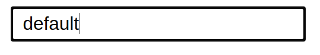

<h1 style='text-align: center'>react-custom-elements</h1>
<br>

```sh
npm install react-custom-elements
```

<br>
<br>

<h4>Buttons</h4>


<p>Button elements with props</p>

```javascript
import { Button } form 'react-custom-elements';

const App = () => {
    return(
        <>
            <Button primary>defuult</Button>
            <Button secondary>text</Button>
            <Button outline></Button>
            <Button dark></Button>
        </>
    )
}

```

<br>
<p>You can use all events of button</p>
<p>For example click event</p>

```javascript
import { Button } form 'react-custom-elements';

const App = () => {
    return(
        <>
            <Button
            onClick={()=> alert('clicked  ')}
            primary>defuult</Button>

        </>
    )
}

```

<br>
<br>
<br>

<h4>Input</h4>
<h6>primary</h6>



<h6>secondary</h6>


<br>

```javascript
import { Input } form 'react-custom-elements';

const App = () => {
    return(
        <>
            <Input primary></Input>
            <Input secondary></Input>
        </>
    )
}

```

<p>You can use all input props with it</P>

```javascript
import { Input } form 'react-custom-elements';

const App = () => {
    return(
        <>
            <Input onChange={(e) => console.log(e.target.value)} secondary></Input>
        </>
    )
}

```

<br>
<table>
    <tr>
        <td>Props</td>
        <td>initial value</td>
    </tr>
    <tr>
        <td>width</td>
        <td>260px</td>
    </tr>
    <tr>
        <td>height</td>
        <td>20px</td>
    </tr>
    <tr>
        <td>...props</td>
        <td>all props of input</td>
    </tr>
</table>

<br>
<br>
<h4>CheckBox</h4>


<br>

```javascript
import { CheckBox } form 'react-custom-elements';

const App = () => {
    return(
        <>
            <CheckBox ></CheckBox>
        </>
    )
}

```

<p>get check value</p>

```javascript
import React, {useState} from 'react';
import { CheckBox } form 'react-custom-elements';

const App = () => {

    const [val, setVal] = useState(false);

    return(
        <>
            <CheckBox setClick={setVal}></CheckBox>
        </>
    )
}

```

<p>Now checkbox value in <b>val</b> variable</p>

<br>
<table>
    <tr>
        <td>Props</td>
        <td>initial value</td>
    </tr>
    <tr>
        <td>w</td>
        <td>24px</td>
    </tr>
    <tr>
        <td>h</td>
        <td>24px</td>
    </tr>
    <tr>
        <td>color</td>
        <td>#111</td>
    </tr>
    <tr>
        <td>bg</td>
        <td>#111</td>
    </tr> 
    <tr>
        <td>borderRadius</td>
        <td>999px</td>
    </tr>
</table>

<br>
<br>
<h4>Dropdown</h4>


<br>

```javascript
import { Dropdown } form 'react-custom-elements';

const App = () => {
    return(
        <>
            <Dropdown selections=['1', '2', '3']></Dropdown>
        </>
    )
}

```

<p>get dropdown selected value</p>

```javascript
import React, {useState} from 'react';
import { Dropdown } form 'react-custom-elements';

const App = () => {

    const [SelectedValue, setSelectedValue] = useState(false);

    return(
        <>
            <Dropdown select={setSelectedValue}></Dropdown>
        </>
    )
}

```

<p>in <b>SelectedValue</b> we have our selected value </p>

<br>
<table>
    <tr>
        <td>Props</td>
        <td>initial value</td>
        <td>Type</td>
        <td>Example</td>
    </tr>
    <tr>
        <td>selections</td>
        <td>none</td>
        <td>array</td>
        <td>['1', '2', '3']</td>
    </tr>
    
</table>
